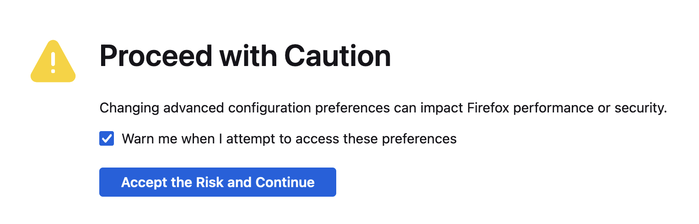
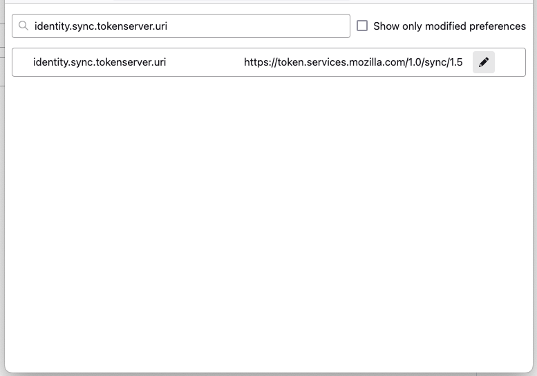
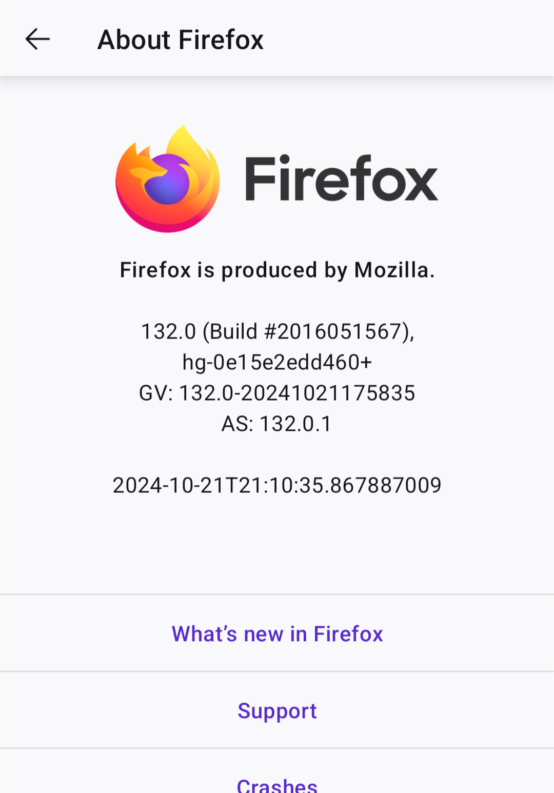
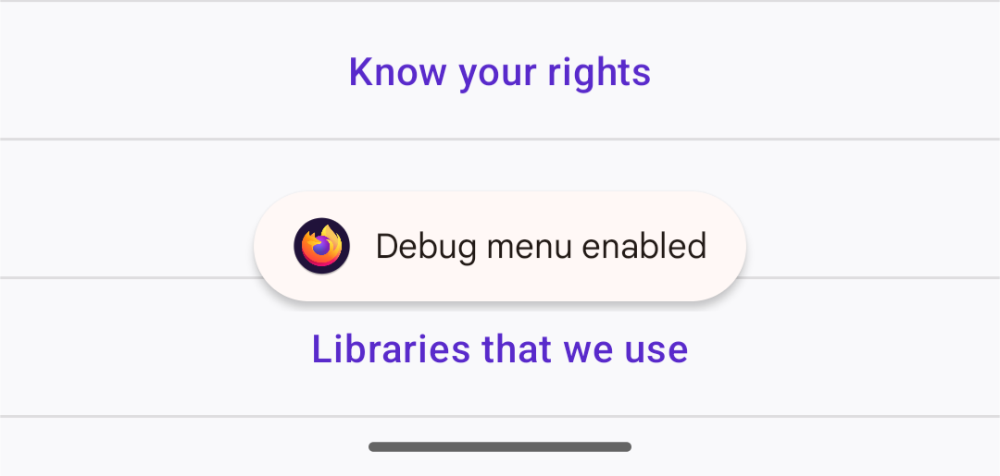
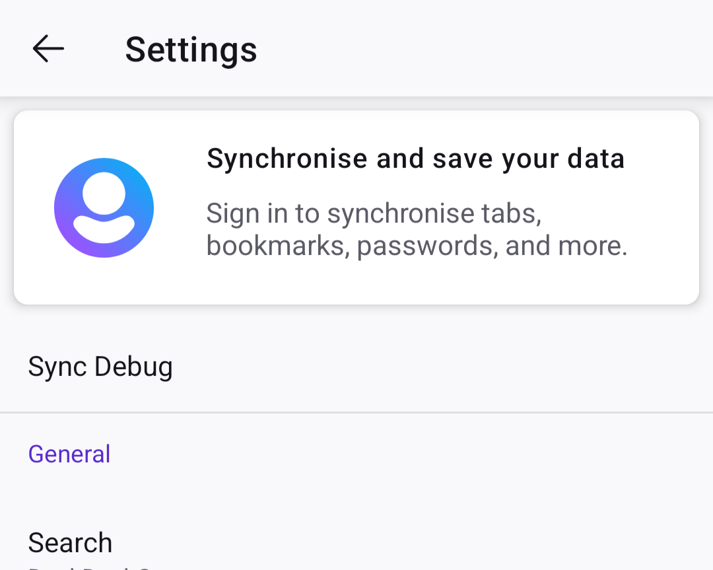
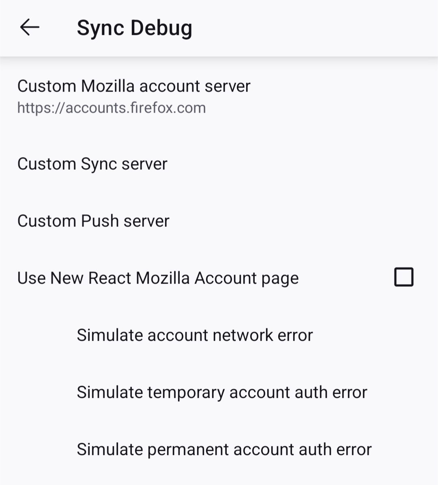

# Configuring Firefox

[Check the TROUBLESHOOTING guide](TROUBLESHOOTING.md) for common pitfalls if the steps below don't work for you.

Please follow these steps to configure your browsers on desktop and Android.

## Check your custom syncserver-rs instance

Once you install syncserver-rs on your Yunohost box, visit the heartbeat URL to
check if everything is OK:

`https://<YOUR_SYNCSERVER_URL>/__heartbeat__`

You should see something along the lines of the following:

```JSON
{
  "database": "Ok",
  "quota": {
    "enabled": false,
    "size": 0
  },
  "version": "0.17.10",
  "status": "Ok"
}
```

Your version number may differ.

## Configure Firefox

First, and the most important bit is that, you **must** sign out of your Mozilla
account under the sync settings if you are signed in. Go to
`about:preferences#sync`, and click "Sign out". Your browser data and the
synchronised data are safe, nothing will be deleted. If you are not signed in,
wait until you configure your browser.

Head to [about:config](about:config). You might be greeted by the following
screen:



Click the "Accept the Risk and Continue" button.

In the configuration screen, search for `identity.sync.tokenserver.uri`. You
should see something like this:



Click the pencil to replace `https://token.services.mozilla.com/1.0/sync/1.5`
with your custom server URL `https://<YOUR_SYNCSERVER_URL>/1.0/sync/1.5`.

Please pay close attention to the URL, if you previously had the URL for the
older SyncStorage implementation, you might have `token` in the path, such as
`token/1.0/sync/1.5`. The new URL shouldn't have the `token`.

Once you save that, restart your browser to be on the safe side.

Head to `about:preferences#sync` and sign in to your Mozilla account.

Your custom SyncStorage server should be working in the background. After the
sync is done, visit `about:sync-log` to see if there are any error logs present.

## Configure Firefox for Android

Open Firefox for Android, and sign out of your Mozilla account, if you are
signed in. Then click on the `⋮` button, and click "Settings". Once in settings,
scroll all the way to the bottom, and click "About Firefox".

When you are in that section, you should see a Firefox logo.



Tap on the logo 3-4 times until you see the "Debug menu enabled" notification at
the bottom of your screen.



Now, you should have a "Sync debug" menu at the top of your Settings.



Click that menu, and click on "Custom Sync server" menu item to enter your
instance's URL. Remember, it should be in the format
`https://<YOUR_SYNCSERVER_URL>/1.0/sync/1.5`, no `token` in the path.



Once you enter that, a "Stop Firefox" menu item will appear. Click on that to
restart Firefox for Android.

Then on your desktop Firefox, visit [firefox.com/pair][1] to start pairing your
Firefox for Android. Once you follow the steps provided, you should be able to
see your synced data, such as open tabs, history etc., on your paired devices.

[1]: https://firefox.com/pair
